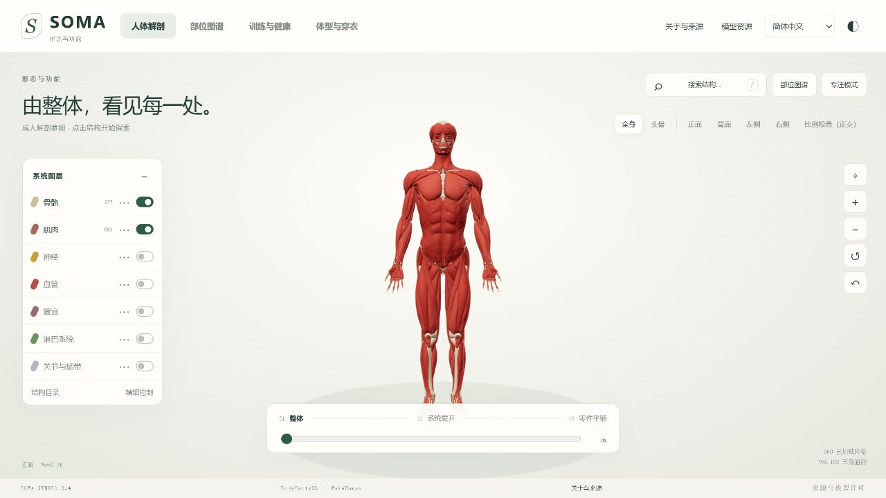
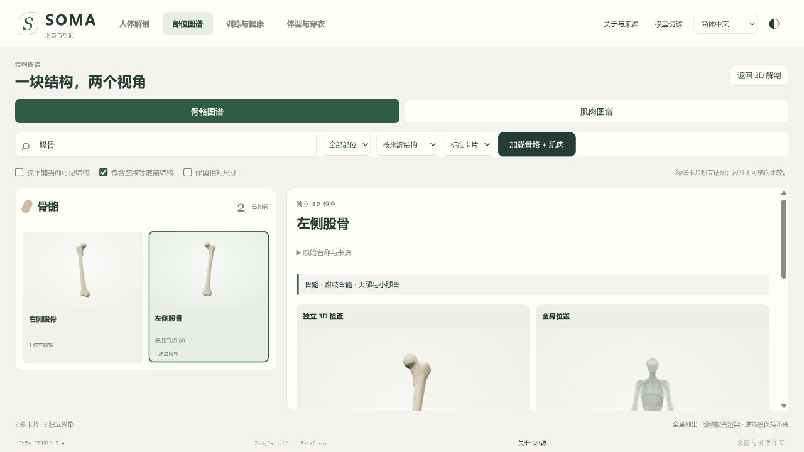
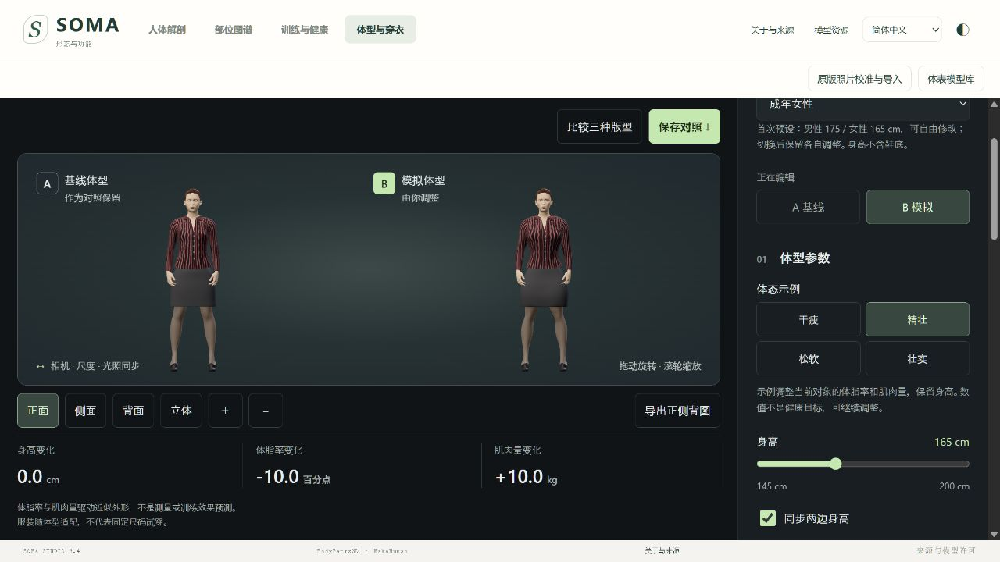

# SOMA · 人体解剖与健康

**ChatGPT Vibe Coding** · 交互式 3D 人体解剖与健康教育网站

从认识肌肉、骨骼和神经开始，连接到训练动作，再观察体型与穿衣的变化。SOMA 的主线是理解身体与健康，体型对比是其中一个辅助模块。

本项目通过 **ChatGPT Vibe Coding** 方式持续开发与整合。第三方人体模型和渲染库的作者及许可证单独保留；这项制作说明不表示模型由 ChatGPT 原创，也不代表 OpenAI 官方项目或医学认证。



## 可以探索什么

| 工作区 | 当前功能 |
| --- | --- |
| 人体解剖 | 骨骼、肌肉、神经、血管、器官、淋巴、关节与韧带七套模型，共 2,914 个来源结构；支持选择、搜索、隐藏、独立显示、透明参照和分离观察。 |
| 部位图谱 | 搜索结构，通过局部 3D 与全身位置双视图理解“在哪里、是什么”。 |
| 训练与健康 | 深蹲、俯卧撑、划船、弯举四组训练卡，与对应肌肉双向定位；提供 WHO 健康资料入口。 |
| 体型与穿衣 | 男女体型 A/B 对比，分别调整体脂率与骨骼肌量，观察四类示例体态、姿态和服装轮廓。 |





以上均为当前版本实际渲染截图。解剖截图所用模型的署名与许可见 [素材说明](ASSET-LICENSES.md)。

## 本地启动

需要 **Python 3.10 或更高版本**，以及支持 WebGL 的现代浏览器。运行不需要 Node.js、npm 安装或 API 密钥；模型和渲染依赖随工程提供。

Windows：解压工程后双击 `START-SOMA.bat`，在浏览器打开启动窗口给出的地址。

也可在工程目录运行：

```sh
python start.py --port 8766
```

通常地址为 [http://127.0.0.1:8766/](http://127.0.0.1:8766/)。端口被占用时会选择下一个可用端口，以启动输出为准。服务器仅监听本机；首次加载会读取本地模型。不要直接双击 `index.html` 以 `file://` 方式打开。

Windows 后台启动：

```sh
python start.py --background --port 8766
```

## 使用建议

1. 从首页的骨骼和肌肉开始，再打开神经等需要的图层。
2. 点击或搜索一个结构，在部位图谱中观察局部形态与全身位置。
3. 打开训练卡，查看对应肌肉；选中相关肌肉也可以返回训练卡。
4. 最后进入体型与穿衣，使用 A/B 对比观察外形示意。

体型参数会在当前页面内保留。需要跨刷新保存时，请导出参数 JSON。

## 语言与当前边界

- 主界面提供简体中文、繁体中文、英语、日语、俄语、德语、法语、西班牙语。部分结构名称保留来源术语；训练正文目前以中文与英文为主。
- 新版体型模块提供简体中文、英语、日语，其他语言明确回退英文。
- 体脂率和骨骼肌量用于**近似外形模拟**，不是人体测量、医学诊断或训练效果预测。映射假设公开在 [COMPOSITION-MAPPING.md](COMPOSITION-MAPPING.md)。
- 解剖模型与体表模型属于不同资产体系，尚未进行内部解剖配准。体型滑块不会变形七套解剖模型。
- 当前为静态姿态和几何服装适配，没有动作教学动画或布料物理模拟。训练与健康内容仍需专业审核，不能代替个人诊疗或训练处方。

## 开发与验证

应用使用原生 HTML、CSS、JavaScript 和 Three.js。`index.html` 是解剖主入口；`body-composition.html` 是同源加载的体型模块。两部分使用各自的渲染上下文。

可选的开发验证需要 Node.js 22 或更高版本与 Python：

```sh
node validate-integration.mjs
node validate-i18n.mjs
node validate-review.mjs
python validate-startup.py
```

现有验证覆盖七套模型解析、训练目标匹配、语言文本与状态恢复。已检查 57 个语言/尺寸/工作区布局场景；这些检查不等于所有设备、医学准确性或全部导出路径都已验收。详见 [验证与实现说明](INTEGRATION-REVIEW.md)。

`legacy/SOMA-3.4-Refit.html` 保留整合前的源文件，供 `build_integration.py` 生成工作副本；运行入口已包含整合结果。重建会更新 `integration.html`，需检查后再替换 `index.html`。

## 素材与许可

- 解剖数据：**BodyParts3D / DBCLS → Z-Anatomy → Dr. Murat Altun**，保留来源署名，当前 GLB 按 **CC BY-SA 4.0** 分发。
- 人体形态、头发与选用衣物：MakeHuman Community 及各资产作者，**CC0-1.0**。
- Three.js：**MIT**，许可证随库保留。
- 应用代码尚未另外授予统一的开源许可证。仓库公开不改变第三方素材的许可条件。

完整作者、固定版本、派生处理及截图许可见 [ASSET-LICENSES.md](ASSET-LICENSES.md)。
